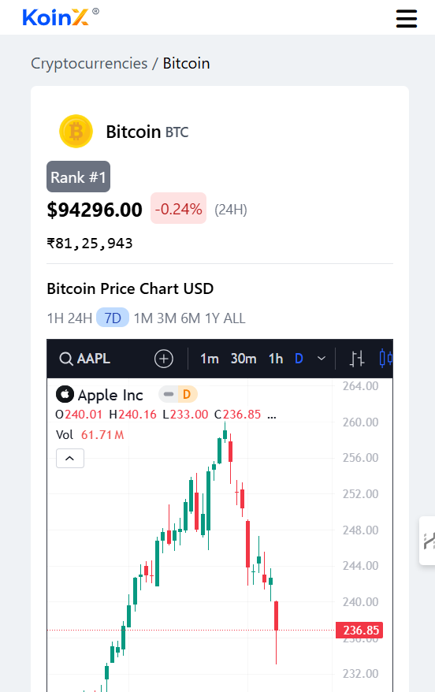

# 💰 Cryptocurrency Dashboard

A responsive cryptocurrency dashboard showcasing Bitcoin and related sections. The application dynamically adjusts its layout based on screen size to provide a seamless user experience.

## ✨ Features
- 📊 `Real-Time Cryptocurrency Data`
- 🔍 `Detailed Views`
- 🤝 `Recommendations Section`
- 📱 `Responsive Design`

## 🛠️ Technologies
- ⚛️ `React`
- 🎨 `Tailwind CSS`
- 🌐 `CoinGecko API`

## 📷 Screenshots

### 🖥️ Desktop View


### 📱 Mobile View



## Installation

1. Clone the repository:
   ```bash
   git clone https://github.com/Shettyankith/coin-website.git
2. Navigate to the project directory:
   ```bash
   cd cryptocurrency-dashboard
3. Install dependencies:
   ```bash
   npm install
4. Run the application:
   ```bash
   npm start

